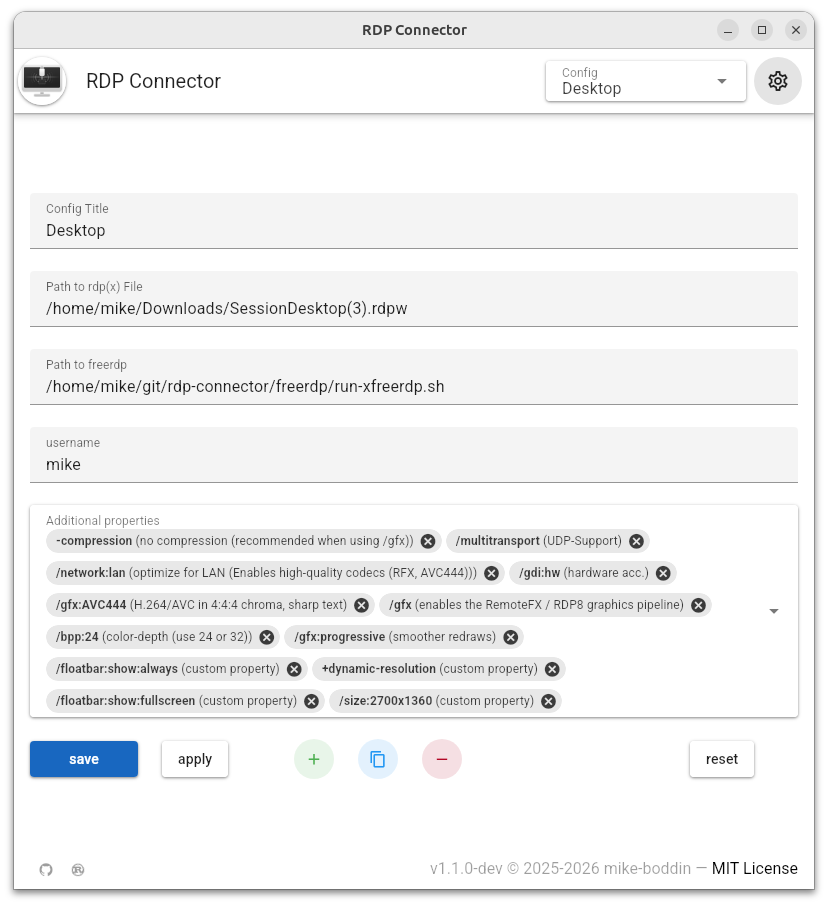
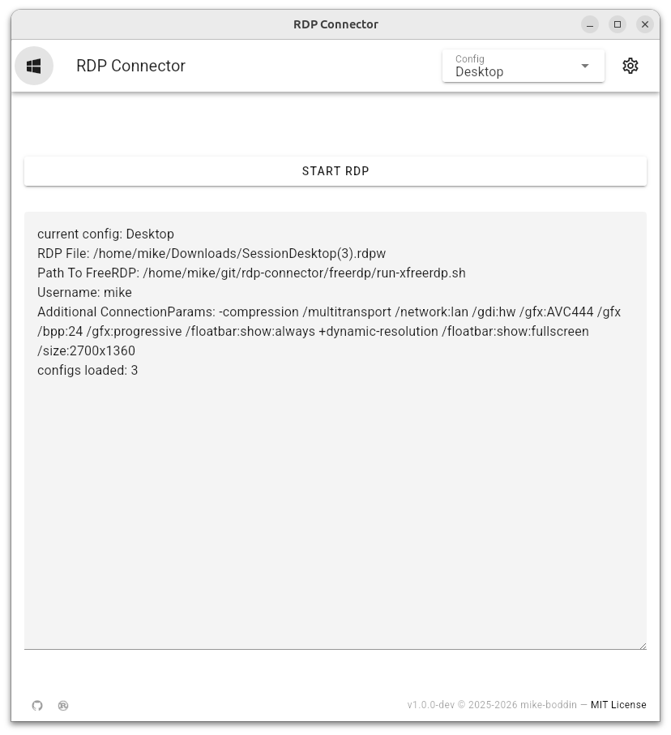

# RDP-Connector

[](https://github.com/mike-boddin/rdp-connector/actions/workflows/build.yml)
[](https://github.com/mike-boddin/rdp-connector/actions/workflows/test.yml)

A Tauri App for wrapping the usage of *.rdpx files with freerdp.  
The main purpose for writing this tool is to handle RDP with Azure Virtual Desktop from a linux machine.  
The oauth login flow will be handled by the RDP-Connector more or less conveniently.

The frontend code is quite a mess. It uses [Vue.js](https://vuejs.org/) with [Vuetify](https://vuetifyjs.com), which is __much more__ than this small UI needs.  
Feel free to contribute and cleanup.

## Where can I get my *.rdpx file for AVD?

If you need to use Azure Virtual Desktop but prefer not to use the web client or the Windows App (for example, if you’re on Linux), you can connect directly to the virtual desktop via RDP.
You can download the RDP configuration file here: [client.wvd.microsoft](https://client.wvd.microsoft.com/arm/webclient/index.html).  

* Login
* Go to the settings tab, choose "Download the rdp file"
* click on your desired virtual machine
* *.rdpx file should be downloaded to your system

## Download ready-to-use binaries

You don't want to build RDP-Connector on your own? You can download recent versions from the [Releases Page](https://github.com/mike-boddin/rdp-connector/releases).  
You can try the latest freerdp binaries from [freerdp.com/releases](https://pub.freerdp.com/releases/).

## Usage

* Start the app.
* Go to the **Settings** tab to manage your RDP configurations:
  * You can now save and manage **multiple RDP configurations**.
  * Use the **Settings Chooser** (the dropdown at the top of the settings page) to switch between different profiles.
  * You can **Add**, **Clone**, or **Delete** configurations as needed.
  * Use the **Copy button** to easily duplicate connection parameters between profiles.
  * (Optional: You can use the wrapper-script from the freerdp binaries in the [Releases Page](https://github.com/mike-boddin/rdp-connector/releases) as "Path to freerdp").

  

* Go to the **Main** page and press **"Start RDP"** to initiate the connection:
  * Use the dropdown menu to select your saved configuration.
  * If a connection is already active, use the **"Jump to RDP"** button to quickly focus the FreeRDP window.
  * You can open a Browser Window pointing to MS Teams by pressing the respective Button next to the **Jump to RDP** Button if you need it (full version)
    * If you don't need it, use the light version

  

## Build and install from Source

You need npm and Rust installed on your system together with some system libraries - check the tauri docs for [prerequisites](https://tauri.app/start/prerequisites/).

```shell
npm i
# Build the "full" version (default)
npm run tauri:build -- --features teams

# Build the "lite" version (no Teams)
npm run tauri:build -- --no-default-features
```

The "full" version includes integration with MS Teams, while the "lite" version omits this feature to reduce the application's footprint. If you are building locally, the `teams` feature is enabled by default.

After this, you get a ready-to-use binary under `src-tauri/target/release/rdp-connector`.  
Also, you get a deb-package for installing on Linux: `src-tauri/target/release/bundle/deb/rdp-connector_1.2.0_amd64.deb`

### (Optional) Build your own freerdp

You can build freerdp with a sensible build-config if you want.
You will need docker for this, or you check the [Dockerfile](freerdp/Dockerfile) and extract its content.  

Build freerdp with:

```shell
chmod +x ./freerdp/build.sh
./freerdp/build.sh
```

Be patient, this will take some time….  

Now you got freerdp binaries with many static linked libraries (not all!) under `freerdp/bin/` and `freerdp/lib`.    
Note: You will probably need some more runtime-dependencies on your system to run freerdp directly.  
But:  
**You should be able to run freerdp with this little wrapper-script without installing external dependencies now:**

```shell
./freerdp/run-xfreerdp.sh
```

## Common errors

###  error while loading shared libraries: libvpx.so

You try to use the compiled freerdp binary directly.  
The here compiled freerdp is built with FFmpeg support, which is statically linked. But ffmpeg has a dependency to a
specific libvpx.so lib which your system doesn't have.

Check your version with  `ls /usr/lib/x86_64-linux-gnu/ | grep libvpx` or `ls /usr/lib64/ | grep libvpx`

If you see a different version, you have to change the used OS in the [Dockerfile](freerdp/Dockerfile) accordingly: 

* Ubuntu 20.04 → older(???)
* Ubuntu 22.04 → libvpx.so.7
* Ubuntu 24.04 → newer(???)

Just build freerdp again...

## Disclaimer

This project is provided "as is", without warranty of any kind, express or
implied, including but not limited to the warranties of merchantability,
fitness for a particular purpose and noninfringement. In no event shall the
authors or copyright holders be liable for any claim, damages or other
liability, whether in an action of contract, tort or otherwise, arising from,
out of or in connection with the software or the use or other dealings in the
software.